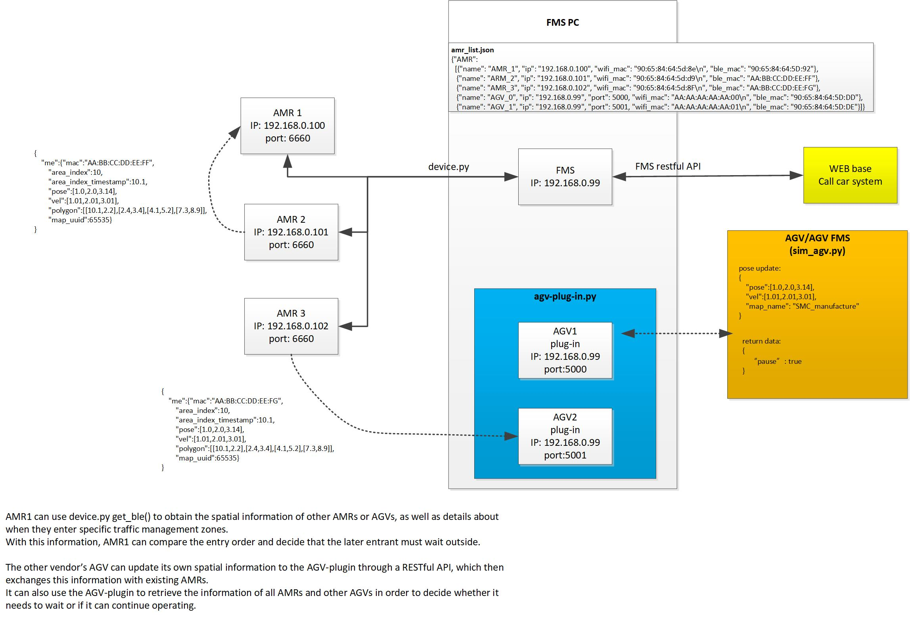

# agv_plug_in
This plugin integrates other manufacturers' AMRs or AGVs into the MSI FMS for unified traffic management. Other manufacturers' AGVs must provide their current spatial coordinates based on the MSI AMR's coordinate system. This plugin can determine the relative spatial coordinates between the MSI AMR and other brands' AGVs.



## agv-plug-in.py
This program is used to bridge with FMS and other AMR/AGV systems.

## sim_agv.py
A simple example program is used to simulate how their AMR/AGV sends out its spatial information and obtains whether it has right-of-way.

## FMS 
If you want to add new AGVs to FMS for management, you must maintain other_robot_list.json. If it doesn't exist, you can rename other_robot_list.json to other_robot_list.json.bak.
The contents of the other_robot_list.json file are as follows:
```
{
  "AMR": [
   {"name": "AGV_0", "ip": "192.168.0.99", "port": 5000, "wifi_mac": "AA:AA:AA:AA:AA:00", "ble_mac": "90:65:84:64:5D:DD"},
   {"name": "AGV_1", "ip": "192.168.0.99", "port": 5001, "wifi_mac": "AA:AA:AA:AA:AA:01", "ble_mac": "90:65:84:64:5D:DE"}
  ]
}

The above content requires necessary modifications.
"name": "xxxx"                            The name of the AGV must not be duplicated, nor can it be the same as the name of the AMR being managed.
"ip": "xxxxxxxxx"                         agv-plug-in.py IP address of the computer running
"port": 5000                              The IP address of the computer running sim_agv.py is unique, so different AGVs are distinguished by their port numbers. It is recommended to start with 5000 and increment the port number.
"wifi_mac": "AA:AA:AA:AA:AA:00"           The AGV wifi mac address
```
"other_robot_list.json" The data will be uploaded to AMR after FMS starts running, so that AMR will know which AGVs will be included in its management.
